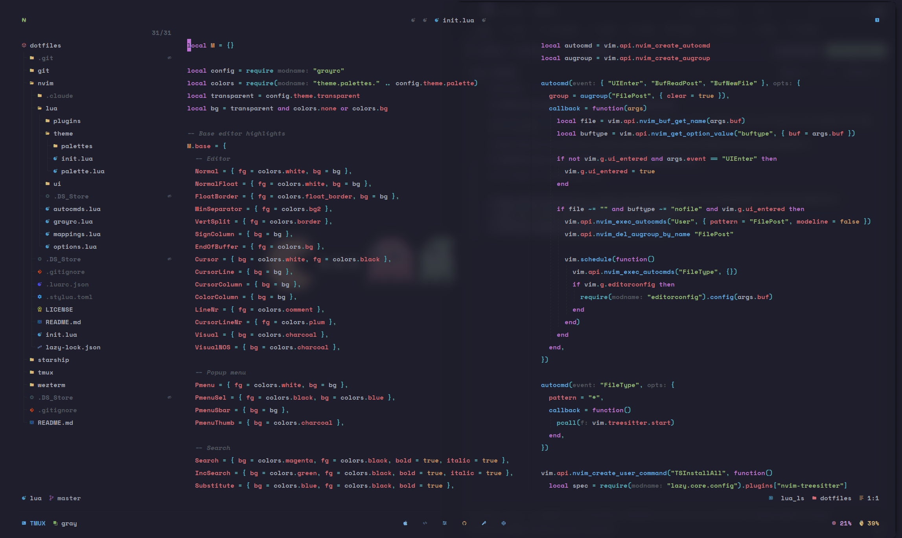
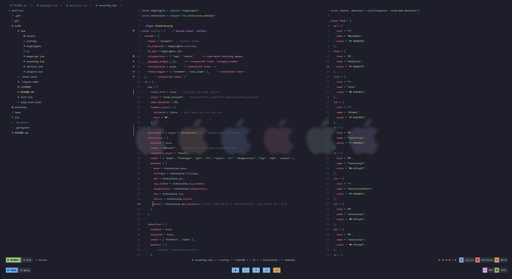
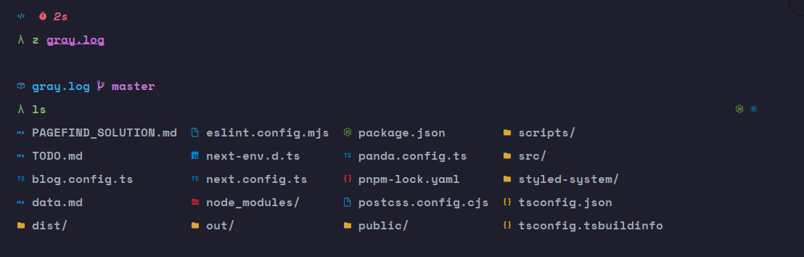

# DOT FILES

## [NVIM](https://github.com/zerochae/dotfiles/tree/master/nvim)

### COMPACT STYLE (WITH TMUX)

### BLOCK STYLE (WITH TMUX)

## [STARSHIP](https://github.com/zerochae/dotfiles/tree/master/starship)

## [TMUX](https://github.com/zerochae/dotfiles/tree/master/tmux)

### COMPACT STYLE

### BLOCK STYLE

## [GIT](https://github.com/zerochae/dotfiles/tree/master/git)
